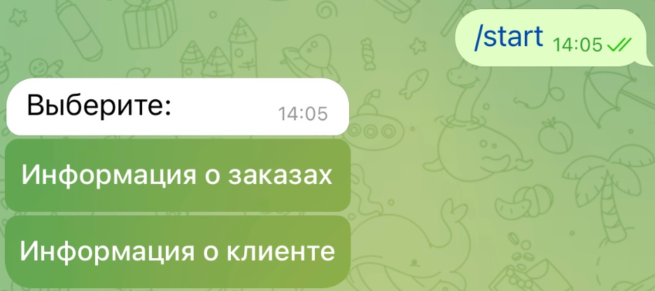
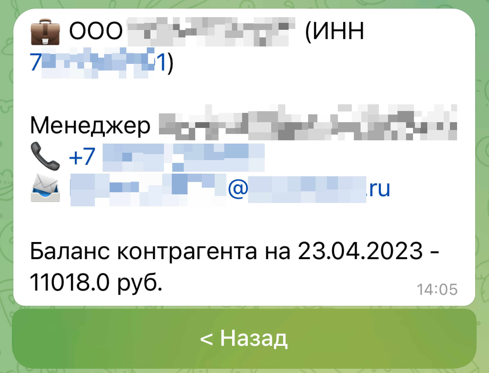
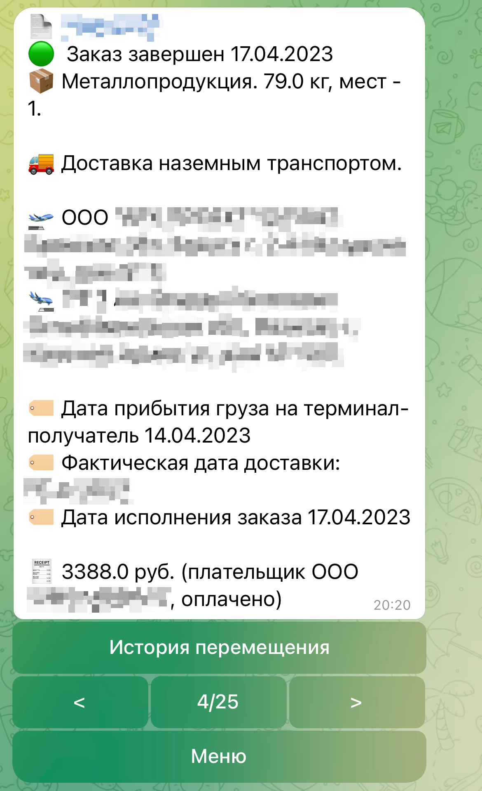
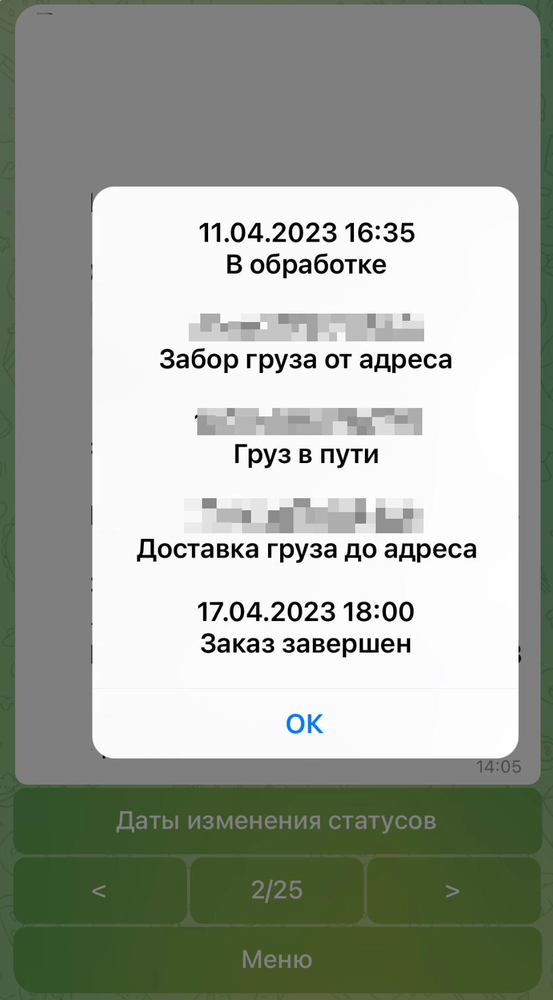

# Телеграм-бот для сервиса Деловые Линии

[](https://github.com/psf/black)


## Описание

Бот для получения информации по заказам. Также предоставляет информацию о контрагенте (вашей организации) с контактной информацией менеджера и текущим балансом. Для каждого заказа (если сервис дает такую возможность) можно получить историю перемещения заказа.

>Разрабатывалось для юридических лиц. Для физических лиц не тестировалось. 

## Зависимости

```
python # 3.11.1
aiogram # 3.0.0b7 бот
sqlalchemy + psycopg + alembic # БД + драйвер + миграции
Jinja2 # шаблоны сообщений
APScheduler # обновление БД по расписанию
```


## Навигация
 
| Стартовая | Информация о клиенте | 
| :---: | :---: | 
|  |  |
| Информация о заказах | Даты изменения статусов |
|  |  |

| Навигация  |
| :---:  | 
| Старт  |
|  | 
| Информация о клиенте |
|  |
| Информация о заказах |
|  |
| Даты изменения статусов |
|  |


# Деплой в докере
1. Клонируем репозиторий 

```bash
git clone https://github.com/nightriddler/dellin_api_bot.git
```

2. В папке `dellin_api_bot` переименовываем `.env.example` в `.env` и заполняем данными.

Вводим ключ, почту и пароль от сервиса Деловые Линии.

Зарегистрировать API-ключ Деловых Линий [тут](https://dev.dellin.ru/registration/).

```
DELLIN_APPKEY=<ключ-от-сервиса>
DELLIN_LOGIN=<почта>
DELLIN_PASSWORD=<пароль>

BOT_TELEGRAM_TOKEN=<токен-бота>
DB_URL=postgresql+psycopg://postgres:postgres@db/postgres

TELEGRAM_CHAT_ID=000000000,111111111,222222222,333333333
```

>В `TELEGRAM_CHAT_ID` указать без пробелов через запятую `CHAT ID` пользователей которые могут пользоваться ботом. `CHAT ID` можно получить в боте `@getmyid_bot`.

3. Запускаем docker-compose

```bash
docker-compose up -d
```

4. Запускаем миграции 

```bash
docker-compose exec bot alembic upgrade head
```

5. При необходимости панель `pgAdmin` доступна по адресу:

```
http://127.0.0.1:5050/
```

6. Заходим в бот, отправляем `/start`, проверяем что все работает


## Работа и настройка бота

Пустую БД бот наполнит заказами и информацией о клиенте при первоначальном нажатии на соответствующие кнопки в меню бота. 

Далее, данные будут отдаваться уже из БД. 

>Бот парсит не все заказы, а только последние 25, что соответствует количеству заказов в [журнале заказов](https://dev.dellin.ru/api/orders/search/) для одной страницы.  


Что касается статусов заказа, то для их отображения будут каждый раз отправляться запросы к АПИ, и тут может наблюдаться различная скорость получения ответа. 

>В `bot/contains.py` значение `UPDATE_TIME` указывает как часто (в секундах) бот в фоновом режиме будет опрашивать АПИ для обновления всех данных в БД. Частоту рекомендуется указать не более 10 минут (600 секунд). 
По-умолчанию, указано полчаса (1800 секунд).

Можно настроить отображение нескольких заказов при нажатии `Информация о заказах`. Для этого в `bot/contains.py` измените параметр `COUNT_ORDER_IN_PAGE`. По-умолчанию стоит `1`. 

>Если делать количество выводимых заказов больше 1 в сообщении, тогда нужно будет изменить текст сообщения  `"Даты изменения статусов"` на более информативное, иначе не ясно будет для какого заказа какая кнопка. Сделать это нужно в  `bot/keyboards.py` в функции `get_orders_keyboard`.


## Документация
[Документация к АПИ Деловые Линии](https://dev.dellin.ru/api/).

## Связаться с автором
>[Telegram](https://t.me/nightriddler)
